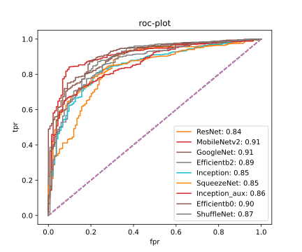

# CNNAlgosComparison

## Models For Comparison (All the models are written from scratch using pytorch)

1. Efficientnet
2. Googlenet
3. ResNet
4. Mobilenet
5. Shufflenet
6. Squeezenet
7. Inceptionnet

## Dataset

- Retianl Disease Classification (https://www.kaggle.com/andrewmvd/retinal-disease-classification)

### Team Members

- Mayank Raj (B19CSE053)
- Gautam Kumar (B19EE031)
- Nirbay Sharma (B19CSE114)

Results:

- **roc-plot**

  
### SqueezeNet
SqueezeNet is a deep learning architecture which is comprised of ”squeeze” and ”expand” layers. The convolution
layer has only 1x1 filter which is fed to expand layer which
has a mix of 1x1 and 3x3 convolution filters. Fire module
comprise of squeeze layer and expand layer together. The
input is sent into conv layer followed by 8 fire module
layers. Followed by another conv layer and max pooling
layer. Dropouts can also be introduced to reduce overfitting.
Small size if SqueezeNet makes it ideal for deployment.
   

### ShufflenNet
The idea of ShuffleNet is to use grouped convolutions,
depth-wise convolutions, and channel shuffle operation.
In grouped convolutions it divides input channels in to
groups and apply kernel filters on each of them, in this
way it reduces the parameters. In depth-wise convolutions
the group size is equal to the number of input channels
so that each filter is applied to each channel and output is
concatenated. In channel shuffle operation it tries to shuffle
the channels and mixed them in between so that features
can traverse in between the channels also. The idea behind
ShuffleNet is to design a light weight CNN architecture
without compromising the accuracy. This is why SuffleNet
uses depthwise convolution.
  
### GoogleNet
The core idea of GoogleNet is to pass the input features to
various sizes of filters such as 1 × 1 filters, 3 × 3 filters,
5 × 5 filters, etc and concatenate the output to pass to
the next set of operations. Later, in order to decrease the
parameters, the 5 × 5 filters are replaced by 3 × 3 filters.
GoogleNet architecture also uses the concept of auxilliary
outputs, which is used in between the architecture to predict
the outputs, so it is like the output layer before the output
layer, the training for such a model is done as follows.
First the output from both the output layers are extracted
and then loss function determines everything as follows. p
indicates predicted probabilities and t indicates target labels,
α is the hyperparameter to provide weight to the auxilliary
output, it is generally 0.3

at the testing time the auxilliary outputs are discarded
and only final output layer is considered.

   
### MobileNet
MobileNet uses the idea of Inverted Residuals with linear
Bottlenecks. As the name suggest, the model was developed
to be easily deployed in mobile phones. MobileNet blends
the ideas of depth-wise convolution, point-wise convolution and residual connections to form MBConv block. These blocks help to reduce the number of
multiplication operations, involved in regular convolution
operations of residual blocks, by a significant margin. In
depth-wise convolution, we apply a single convolutional
filter for each input channel. In the regular 2D convolution
performed over multiple input channels, the filter is as deep
as the input. Depth-wise filter is a a spatial convolution
performed independently over each channel of an input as
shown in fig 1. Point-wise convolution is a simple scalar
multiplication using 1×1 filter, used to scale the number of
channels as per the requirement.

   
###  EfficientNet
Through a detailed analysis researchers found that carefully
balancing network depth, width and resolution can lead
to better performance. Images with higher resolution need
deeper networks. Different scaling dimensions are not independent. EfficientNet introduced a new scaling method
that uniformly scales all dimensions of depth (d), width (w)
and resolution (r). It uses a new compound scaling method,
which uses compound coefficient ϕ. 

Here ϕ is user specified coefficient
that specifies how many more resources are available.
Just like MobileNet, EfficientNet also uses MBConv
blocks as shown in fig 2. We have considered EfficientNet-B0
and EfficientNet-B2 for comparison with other models. Both
uses = 1.2, β = 1.1 and γ = 1.15, for ϕ = 1. They also use
squeeze and excitation optimization

   
### Inception v3
The idea of Inception v3 is to used residual layers with
varied types of convolutions operations. It is basically an
improvement over Inception v2, it uses various block such
as Inception{A,B,C,D,E} and IncpetionAux block for the
auxillary output in between the layers, the architecture of
Inception{A,B,C,D,E} is similar to Fig 3 where in each layer
there are various branches which has different kernel sizes
as 1 × 5, 5 × 1, 1 × 7, 7 × 1 etc. and the final output from
the branches is then concatenated to pass on to the next
branch which also has similar architecture, the auxiliary
output helps the model to learn the features better and thus
increase the performance by a large margin, the loss function
equation for Inception v3 is similar to GoogleNet auxiliary
ouptut.

